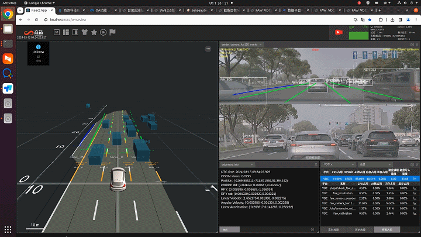
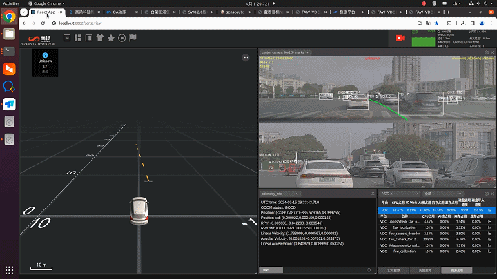
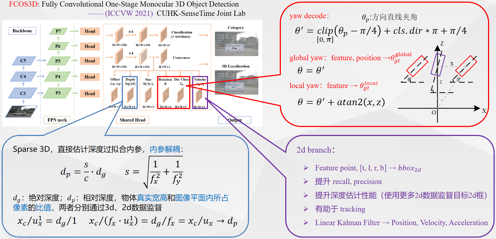
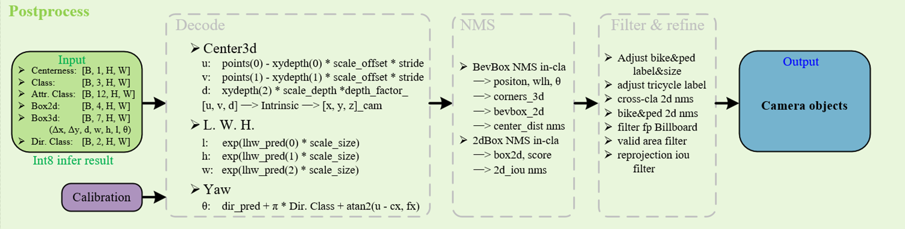
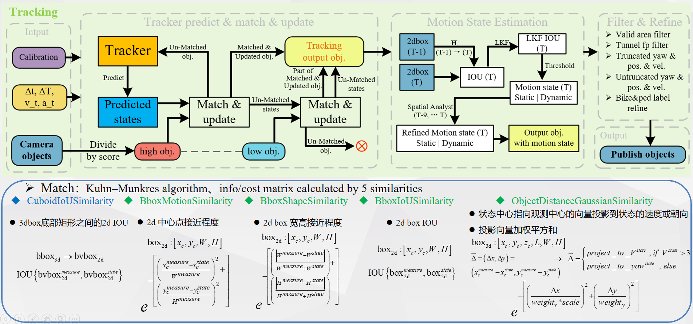
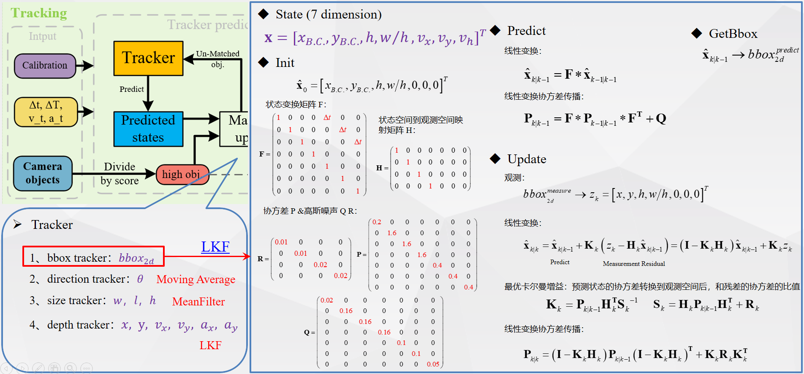
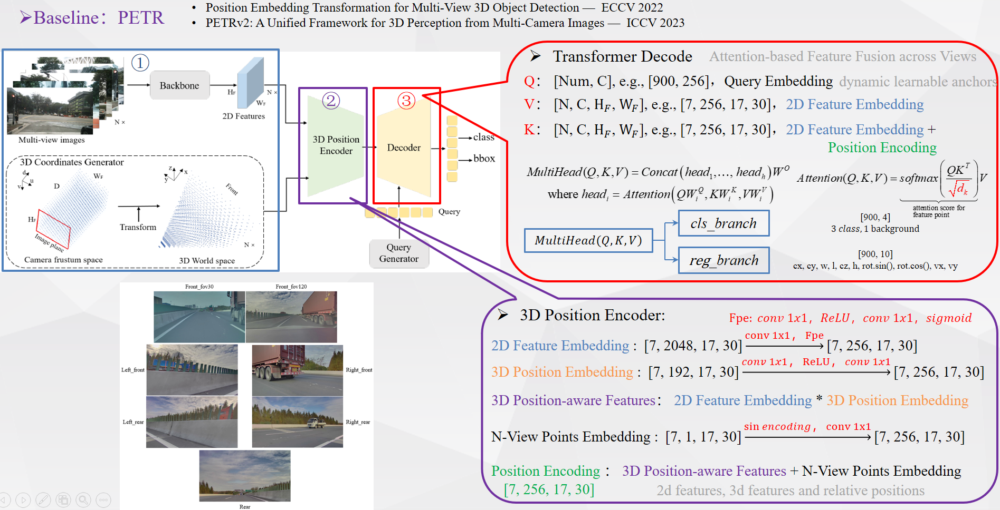

## Mono3D - 3D Object Detection for Autonomous Driving

| Mono3D | BEV |
|--------|--------|
|  |  |
|  |  |

This repo involves two state-of-the-art algorithms: FCOS3D and PETR, based on the MMDetection3D framework. Our improvements have been integrated into a production-ready 3D detection solution for autonomous driving camera perception. The solution includes two key frameworks: Mono3D and 7V BEV, both of which have been deployed in production across tens of thousands of vehicles, including those from FAW, Hezhong, and GAC.

### Mono3D (FCOS3D)

### 7V BEV (PETR)

### Acknowledgements

This project involves the following open-source research and code:

- [FCOS3D](https://arxiv.org/abs/2104.10956) - A 3D object detection framework based on FCOS.
- [PETR](https://github.com/megvii-research/PETR) - An algorithm for efficient 3D object detection and tracking.
- [MMDetection3D](https://github.com/open-mmlab/mmdetection3d) - The framework used for 3D object detection.

Special thanks to the authors of these projects and to the open-source community for their contributions to the field.
